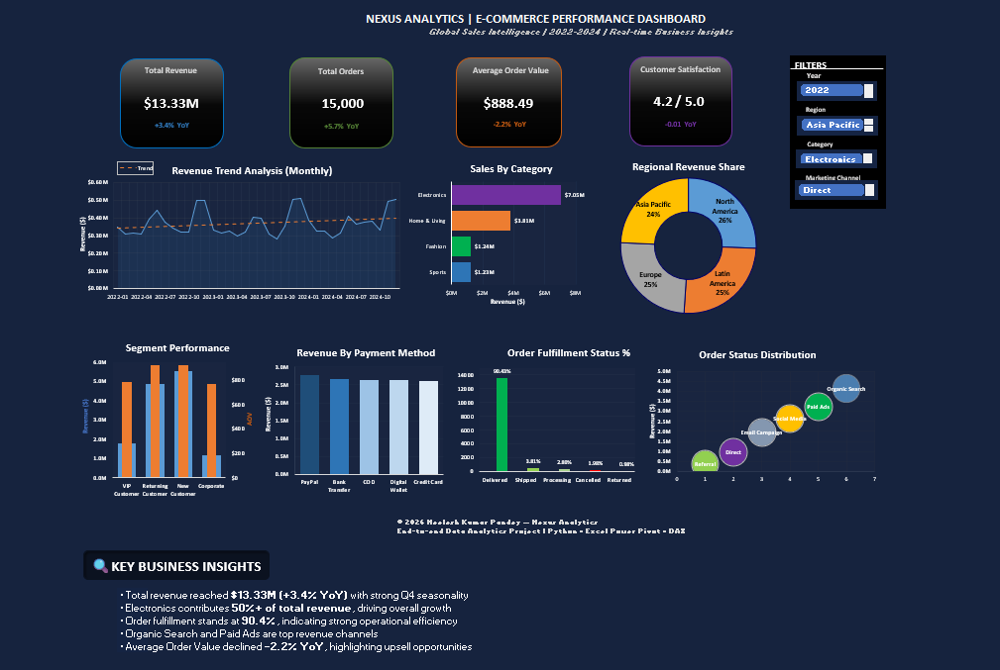

# 📊 Nexus Analytics – E-Commerce Performance Dashboard

## 🚀 Project Overview

Nexus Analytics is an end-to-end Data Analytics project demonstrating the complete workflow:

- Synthetic data generation using Python
- Data cleaning and modeling in Excel Power Pivot
- DAX measures for KPIs and YoY analysis
- Interactive executive dashboard
- Business insight generation

This project simulates a real-world e-commerce analytics environment.

---

## 🧱 Project Structure

### 📁 [01_Data](01_Data)
Raw CSV data generated using Python scripts.

### 📁 [02_Documentation](02_Documentation)
Problem statement, solution methodology, and business insights.

### 📁 [03_Dashboard_Exports](03_Dashboard_Exports)
Final dashboard exports (Image + PDF).

### 📁 [04_Resources](04_Resources)
Data dictionary and KPI definitions.

### 📊 Nexus_Analytics.xlsx
Main Excel workbook containing:
- Power Pivot data model
- DAX measures
- KPI cards
- Interactive dashboard

---

## 🔍 Key Highlights

- Revenue analysis with YoY comparison
- Category & regional performance
- Customer segmentation
- Order fulfillment monitoring
- Marketing channel effectiveness
- Executive-style dashboard design

---

## 🛠 Tools Used

- Python (data generation)
- Microsoft Excel Power Pivot
- DAX
- PivotTables
- Advanced dashboard design

---

## 📈 Key Business Insights

- Revenue reached $13.33M with positive YoY growth
- Electronics contributes over 50% of sales
- Order fulfillment at 90.4%
- Organic Search & Paid Ads drive highest revenue
- AOV declined YoY, highlighting upsell opportunities

---

## 📬 Contact

GitHub: https://github.com/neelesh-pandey22  
LinkedIn: www.linkedin.com/in/neelesh-kumar-pandey  
Email: neeleshkumar9823@gmail.com  

---

© 2026 Neelesh Kumar Pandey — Nexus Analytics Portfolio Project  
Synthetic data generated via Python | Dashboard built using Excel Power Pivot & DAX
